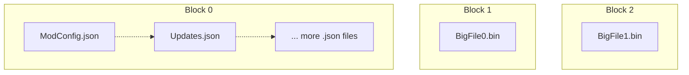

	<h1>The Nexus (.nx) Archive Format</h1>
	
	   
    A Quite OK Archive Format.
     
    For <i>Storing</i> and <i>Sharing</i> Mods. 
    
    

## About

The Nexus (`.nx`) format is a semi-SOLID archive format, using *modern* compression technologies such as
[ZStandard](http://facebook.github.io/zstd/) and [LZ4](http://lz4.github.io/lz4/) under the hood.

Between size optimized SOLID archives like `.7z` w/ `LZMA` and non-SOLID archives like `.zip` w/ `Deflate`, the Nexus
(`.nx`) format bridges the gap; providing a tradeoff with most of the benefit of both worlds.

We aim to create a simple format, appropriate for both local storage of mods and for downloading from the web.  
By using modern compression techniques, we provide both competitive file size and compression speeds.  

To learn more, have a look at the [dedicated documentation page](https://nexus-mods.github.io/NexusMods.Archives.Nx/) 🧡.