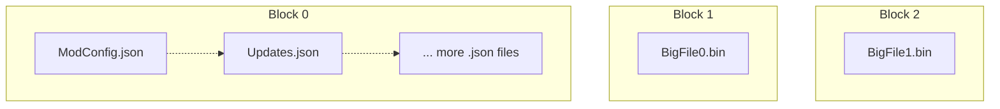

# Format Specification

!!! tip "File Format Version: `1.0.0`"

!!! note

    This is a semi-SOLID archive format for storing game mod content; intended to double up as a packaging format for uploading mods.

It has the following properties:  

- Files under Block Size are SOLID Compressed.  
- Files above Block Size are non-SOLID Compressed.  
- Variable Block Size.  
- Stores File Hashes Within.  
- Huge Files Split into Chunks for Faster (De)compression.  
- TOC in-front.  

We use SOLID compression to bundle up small files together, while keeping the large files as separate compressed blobs.  
All files are entirely contained within a slice of a given block.  



Offsets of each block is stored in header, therefore large files can be completely skipped during the extract operation
if a small file is all that is needed.

!!! note 

    This format is optimized for transferring and unpacking files; editing existing archives might lead to sub-optimal performance.

## Overall Format Layout

The overall file is structured in this order:  

```
| Header + TOC | Block 1 | Block 2 | ... | Block N |
```

All sections (indicated by `|`) are 4096 aligned to match physical sector size of modern drives and page granularity.  

Field sizes used below are similar to Rust notation; with some custom types e.g. 

- `u8`: Unsigned 8 bits.  
- `i8`: Signed 8 bits.  
- `u4`: 4 bits.  
- `u32/u64`: 4 Bytes or 8 Bytes (depending on variant).  

Assume any bit packed values are sequential, i.e. if `u4` then `u4` is specified, first `u4` is the upper 4 bits.  

All packed fields are `little-endian`; and written out when total number of bits aligns with a power of 2.  

- `u6` + `u12` is 2 bytes `little-endian`  
- `u15` + `u17` is 4 bytes `little-endian`  
- `u26` + `u22` + `u16` is 8 bytes `little-endian`  
- `u6` + `u11` + `u17` ***is 4 bytes*** `little-endian`, ***not 2+2***  

### Terminology

- `Block`: Represents a compressed section of data of any size smaller than [chunk size](./File-Header.md#chunk-size).
- `Chunk`: A `block` that corresponds to a slice of a file.
    - A file compressed in a single `block` is said to have 1 chunk.
    - A file compressed in multiple `block`(s) is said to have multiple chunks.

## Use as Packaging Format

!!! tip

    Inclusion of hash for each file has some nice benefits.

- Can do partial download to upgrade from older version of mod.  
    - We can download header (incl. [Table of Contents](./Table-Of-Contents.md)) only, compare hashes.  
    - Then only download the chunks we need to decompress our needed data.  
    - Inspired by MSIX and certain Linux package formats.  

- Certain applications like [Nexus Mods App](https://github.com/Nexus-Mods/NexusMods.App) can avoid re-hashing files.  

## Previewing the Format

!!! info 

    For people wishing to study the format, or debug it, a [010-Editor](https://www.sweetscape.com/010editor/) template 
    is available for usage [010 Template](./010Template.bt).  

Hit `Templates -> Open Template` and then the big play button.  
Then you'll be able to browse the format in 'Variables' window.  

Alternatively, contributions are welcome if anyone wants to make a [Kaitai Struct](https://kaitai.io) variation 💜.

## Version History

!!! info "This is the version history for the file format, not the reference implementation/library."

### 1.0.0

!!! info "Initial Release"

    Last commit with previous version: `196d116d09cd436818dfd596e069eaef2b7a616d`

Dated 21st of July 2024, this marks the 'initial release' as `1.0.0`.

#### File Header Changes

This release removes the `Block Size` (u4) field from the header, as this can vary
per block and with the use of features such as deduplication and archive merging.
It was also not used in the reference implementation anywhere.

Instead, the `Chunk Size` field is extended to 5 bits and the header page count to
15 bits. This allows the [chunk size](./File-Header.md#chunk-size) to be in range
of `512 bytes` to `1 TiB`. (Previous range `32K` - `1GiB`)

The version field is repurposed. In the previous version, it was used to indicate
the version of the table of contents. Now that is moved to the actual table
of contents itself. The version field is now used to indicate incompatible changes
in the format itself. This field is `u7`. The previous field, was moved to the actual
[Table of Contents](./Table-Of-Contents.md#version) itself.

The `Header Page Count` field is extended to 16 bits, allowing for a max size of 
256MiB. This allows for storage of [arbitrary user data](./User-Data.md)
as part of the Nx header. A reserved, but not yet implemented section for
[User Data](./User-Data.md) was also added to the header.

The [Table of Contents](./Table-Of-Contents.md) has also received its own proper
'size' field. Which led to some fields being slightly re-organised.
