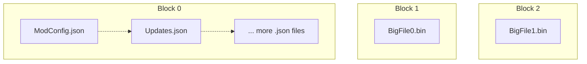

# Format Specification

!!! note

    This is a semi-SOLID archive format for storing game mod content; intended to double up as a packaging format for uploading mods.

It has the following properties:  

- Files under Block Size are SOLID Compressed.  
- Files above Block Size are non-SOLID Compressed.  
- Variable Block Size.  
- Stores File Hashes Within.  
- Huge Files Split into Chunks for Faster (De)compression.  
- TOC in-front.  

We use SOLID compression to bundle up small files together, while keeping the large files as separate compressed blobs.  
All files are entirely contained within a slice of a given block.  



Offsets of each block is stored in header, therefore large files can be completely skipped during the extract operation
if a small file is all that is needed.

!!! note 

    This format is optimized for transferring and unpacking files; editing existing archives might lead to sub-optimal performance.

## Overall Format Layout

The overall file is structured in this order:  

```
| Header | TOC | Block 1 | Block 2 | ... | Block N |
```

All sections [including block data] are 4096 aligned to match physical sector size of modern drives and page granularity.  

Field sizes used below are similar to Rust notation; with some custom types e.g. 

- `u8`: Unsigned 8 bits.  
- `i8`: Signed 8 bits.  
- `u4`: 4 bits.  
- `u32/u64`: 4 Bytes or 8 Bytes (depending on variant).  

Assume any bit packed values are sequential, i.e. if `u4` then `u4` is specified, first `u4` is the upper 4 bits.  

All packed fields are `little-endian`; and written out when total number of bits aligns with a power of 2.  

- `u6` + `u12` is 2 bytes `little-endian`  
- `u15` + `u17` is 4 bytes `little-endian`  
- `u26` + `u22` + `u16` is 8 bytes `little-endian`  
- `u6` + `u11` + `u17` ***is 4 bytes*** `little-endian`, ***not 2+2***  

## Use as Packaging Format

!!! tip

    Inclusion of hash for each file has some nice benefits.

- Can do partial download to upgrade from older version of mod.  
    - We can download [Table of Contents](./Table-Of-Contents.md) only, compare hashes.  
    - Then only download the chunks we need to decompress our needed data.  
    - Inspired by MSIX and certain Linux package formats.  

- Certain applications like [Nexus Mods App](https://github.com/Nexus-Mods/NexusMods.App) can avoid re-hashing files.  

## Previewing the Format

!!! info "ToDo"

    Add link once library is written and template actually exists.

!!! info 

    For people wishing to study the format, or debug it a [010-Editor](https://www.sweetscape.com/010editor/) template 
    is available for usage [Link Pending].  

[Include Instructions Here]

If anyone wants to make a [Kaitai Struct](https://kaitai.io) variation; contributions are welcome 💜.