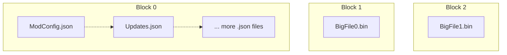

---
hide:
  - toc
---

	<h1>The Nexus (.nx) Archive Format</h1>
	
	   
    A Quite OK Archive Format.
     
    For <i>Storing</i> and <i>Sharing</i> Mods. 
    
    

## About

The Nexus (`.nx`) format is a semi-SOLID archive format, using *modern* compression technologies such as
[ZStandard](http://facebook.github.io/zstd/) and [LZ4](http://lz4.github.io/lz4/) under the hood.

Between size optimized SOLID archives like `.7z` w/ `LZMA` and non-SOLID archives like `.zip` w/ `Deflate`, the Nexus 
(`.nx`) format bridges the gap; providing a tradeoff with most of the benefit of both worlds.

We aim to create a simple format, appropriate for both local storage of mods and for downloading from the web.  
By using modern compression techniques, we provide both competitive file size and compression speeds.  

## Motivation

!!! nexus "For the [Nexus](https://github.com/Nexus-Mods/NexusMods.App) App"

    We recompress legacy uploaded mods for faster deployment and re-deployment.  
    And can skip hashing after downloading a `.nx` file.  

!!! nexusheart "For the Community"

    We can get cool tech in the hands of people; and contribute back to the open source community.

- For ***Fast Random Access***

We use ***small*** SOLID blocks, for grouping ***small*** files where SOLID compression matters the ***most***.  
Combine with blazing fast 5000+MB/s (modern CPU) single core [LZ4](http://lz4.github.io/lz4/) for pretty *decent* random access speeds.  

- For ***Storage Sizes***

For longer term archival and smaller downloads; bigger files are handled by [ZStandard](http://facebook.github.io/zstd/) to reduce total size.  
You probably don't need to preview them instantly, so it makes sense, right?  

- For ***File Downloads***

This format allows us to do partial downloads of mods.  
If only a few files in a mod were updated; why should you need to download the entire thing again?  

## Technical Questions

If you have technical questions, direct them to library & docs author [@Sewer56](https://github.com/Sewer56) 
via one of these methods:  

- [Nexus Discord](https://discord.gg/nexusmods)  
- [Open an Issue](https://github.com/Nexus-Mods/NexusMods.Archives.Nx/issues/new)  

Happy Hacking 🧡